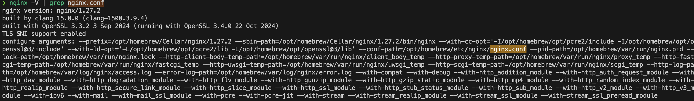
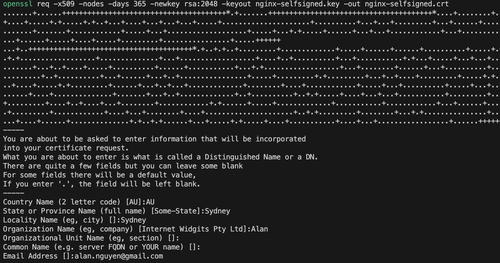

## Table of Contents
- [Table of Contents](#table-of-contents)
- [Setup](#setup)
  - [Install Nginx](#install-nginx)
  - [Check Nginx config path](#check-nginx-config-path)
  - [Overide the nginx.conf file](#overide-the-nginxconf-file)
  - [Generate self-signed certificate](#generate-self-signed-certificate)
  - [Reference](#reference)
  - [Commands used in the tutorial](#commands-used-in-the-tutorial)
      - [start nginx](#start-nginx)
      - [get options](#get-options)
      - [restart nginx](#restart-nginx)
      - [stop nginx](#stop-nginx)
      - [print logs](#print-logs)
      - [restart nginx](#restart-nginx-1)
      - [create folder for nginx certificates](#create-folder-for-nginx-certificates)
      - [create self-signed certificate](#create-self-signed-certificate)
## Setup
- MacOS
- 

### Install Nginx
```bash
brew install nginx && nginx -v
```

### Check Nginx config path
```bash
nginx -V
```

👉 /opt/homebrew/etc/nginx/nginx.conf

### Overide the nginx.conf file
```bash
cat nginx.conf >  /opt/homebrew/etc/nginx/nginx.conf
```

### Generate self-signed certificate
```bash
mkdir nginx-certs &&
cd nginx-certs &&
openssl req -x509 -nodes -days 365 -newkey rsa:2048 -keyout nginx-selfsigned.key -out nginx-selfsigned.crt
```

Enter some basic information of the certificate that promted


### Reference
[](https://www.youtube.com/watch?v=q8OleYuqntY)
[](https://gitlab.com/twn-youtube/nginx-crash-course)


### Commands used in the tutorial

##### start nginx
`nginx`

##### get options
`nginx -h`

##### restart nginx
`nginx -s reload`

##### stop nginx
`nginx -s stop`  

##### print logs
`tail -f /usr/local/var/log/nginx/access.log`

##### restart nginx
`nginx -s reload`

##### create folder for nginx certificates
`mkdir ~/nginx-certs`
`cd ~/nginx-certs`

##### create self-signed certificate
`openssl req -x509 -nodes -days 365 -newkey rsa:2048 -keyout nginx-selfsigned.key -out nginx-selfsigned.crt`
